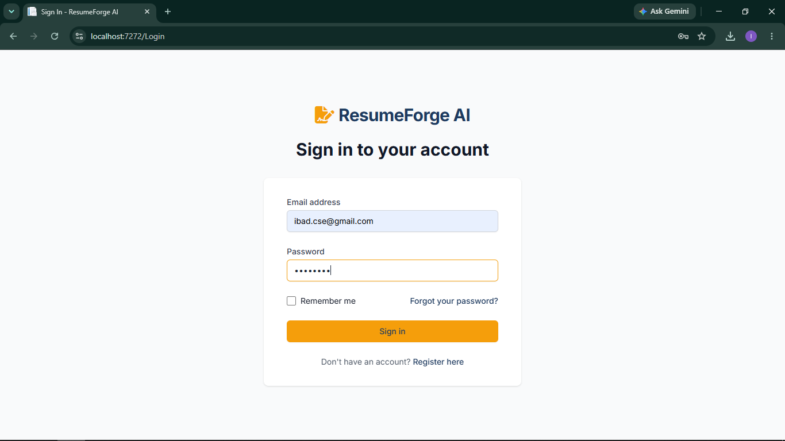
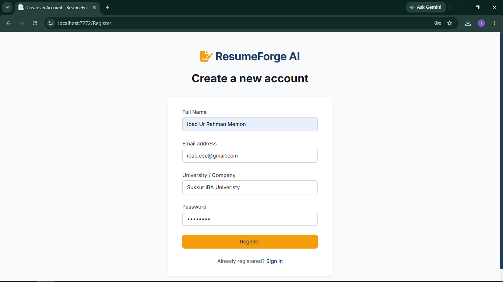
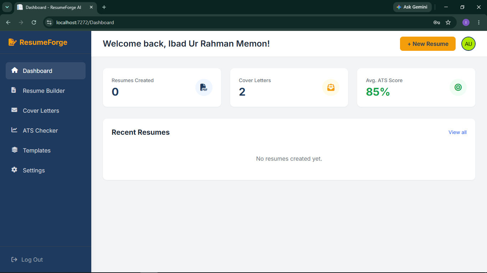
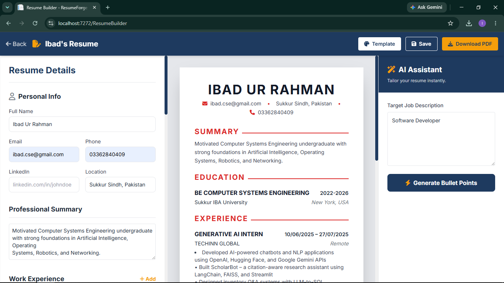
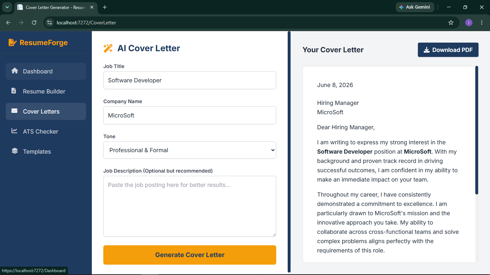
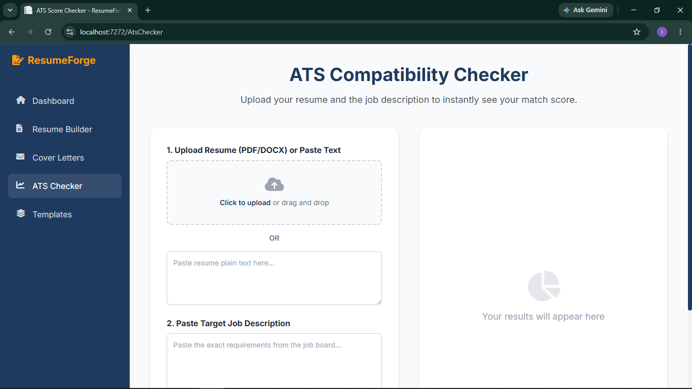
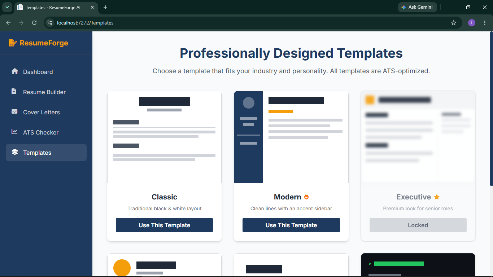

<div align="center">

# 🔨 ResumeForge AI

**An AI-powered career toolkit that helps job seekers craft perfect resumes,
generate tailored cover letters, and confidently pass Applicant Tracking Systems (ATS).**

[](https://dotnet.microsoft.com/)
[](https://learn.microsoft.com/en-us/aspnet/core/razor-pages)
[](https://console.groq.com/)
[](https://tailwindcss.com/)
[](https://github.com/UglyToad/PdfPig)
[](LICENSE)

</div>

---

## 📋 Table of Contents

- [Overview](#-overview)
- [Key Features](#-key-features)
- [Application Screenshots](#-application-screenshots)
- [Tech Stack](#-tech-stack)
- [Project Structure](#-project-structure)
- [Getting Started](#-getting-started)
- [AI Integration Details](#-ai-integration-details)
- [Contact](#-contact)

---

## 🌟 Overview

**ResumeForge AI** is a comprehensive, full-stack web application designed for the modern job application process. Navigating today's competitive job market means getting past automated Applicant Tracking Systems (ATS) before a human ever sees your resume — this project bridges that gap.

The platform provides an end-to-end career toolkit:

- 🔨 **Build** a polished resume with a live split-screen editor
- 🤖 **Generate** AI-powered bullet points tailored to any job description
- ✉️ **Create** professional cover letters in seconds with configurable tone
- 📊 **Analyse** your resume's ATS compatibility against a real job posting
- 🎨 **Choose** from multiple professionally designed, ATS-optimised templates

All AI features run on the lightning-fast **Groq API with Llama 3.1 8B**, delivering near-instant generative responses without the latency of heavier model endpoints.

---

## ✨ Key Features

### 🤖 AI-Powered ATS Compatibility Checker
Upload your resume (PDF/DOCX) or paste it as plain text alongside a target job description. The Groq Llama 3.1 engine performs a deep semantic analysis and returns:
- An overall **ATS match score** (0–100%)
- **Matched keywords** found in both resume and job description
- **Missing keywords** to add for a higher score
- **Actionable AI suggestions** for targeted improvements

### 📄 Interactive Resume Builder
A three-panel split-screen builder with a real-time live preview:
- Fill in Personal Info, Summary, Work Experience, Education, and Skills
- The centre panel renders your resume **live as you type** — no page reload needed
- **AI Assistant panel**: paste a job description and generate 4–5 ATS-optimised bullet points per experience entry with one click
- Switch between **5 visual templates** (Modern, Classic, Creative, Minimal, Tech) that apply instantly to the preview
- **Download as PDF** — A4-optimised, margin-perfect output via html2pdf.js
- **Save** your resume and access it from the Dashboard at any time

### ✉️ AI Cover Letter Generator
Generate a complete, professional cover letter in seconds:
- Input: Job Title, Company Name, and Tone (Professional & Formal / Enthusiastic & Creative / Concise & Direct)
- Optionally paste the job description for a more targeted result
- Preview renders the full letter with date, greeting, and formatted body
- **Download as PDF** with one click
- All generated letters are saved to your account

### 🎨 Templates Gallery
Six professionally designed, ATS-optimised resume templates:

| Template | Description |
|---|---|
| **Classic** | Traditional black-and-white — maximally ATS-compatible |
| **Modern** *(Default)* | Clean lines with a dark navy accent sidebar |
| **Executive** *(Premium)* | Two-column layout targeting senior roles — locked tier |
| **Creative** | Avatar/photo element for creative industry roles |
| **Minimal** | Typographically focused, clean whitespace |
| **Tech/Developer** | Dark terminal-inspired theme for technical roles |

### 📊 Personal Dashboard
A personalised overview of your account activity:
- Total resumes created, cover letters generated, and average ATS score
- Recent resumes list with quick-edit and download access
- One-click **+ New Resume** creation

### 🔐 Secure Authentication
- Email + password registration and login
- Cookie-based session authentication (ASP.NET Core)
- CSRF protection on all POST forms
- Remember Me and Forgot Password support

---

## 📸 Application Screenshots

### Sign In
*Clean, centred authentication page with the ResumeForge AI brand.*



---

### Create Account
*Simple registration form collecting name, email, university/company, and password.*



---

### Dashboard
*Personalised welcome with summary stats — resumes created, cover letters generated, and average ATS score.*



---

### Resume Builder
*Three-panel split-screen editor: data entry form (left), live resume preview (centre), and AI Assistant (right).*



---

### AI Cover Letter Generator
*Input job title, company, and tone on the left; formatted cover letter renders in real time on the right.*



---

### ATS Compatibility Checker
*Upload or paste your resume alongside a job description to get an instant match score and keyword breakdown.*



---

### Templates Gallery
*Six ATS-optimised visual themes — select any to apply it instantly to your resume preview.*



---

## 💻 Tech Stack

| Layer | Technology | Detail |
|---|---|---|
| **Backend** | C# / .NET 8.0 | ASP.NET Core Razor Pages |
| **Frontend** | HTML5, Tailwind CSS, Vanilla JS | Razor syntax templating |
| **AI Engine** | Groq API | `llama-3.1-8b-instant` via HttpClient |
| **PDF Export** | html2pdf.js | Client-side A4 PDF generation |
| **PDF Parsing** | UglyToad.PdfPig | Server-side resume text extraction |
| **Data Storage** | JSON Flat-File | Custom lightweight database layer |
| **Authentication** | ASP.NET Core Cookie Auth | Claims-based session identity |
| **Build / IDE** | .NET 8 SDK + Visual Studio 2022 | MSBuild |

---

## 📁 Project Structure
```text
ResumeForgeAI/
├── Data/
│   └── AppDatabase.cs           # JSON data access layer (users, resumes, cover letters)
├── Models/
│   └── ErrorViewModel.cs
├── Pages/
│   ├── Login.cshtml(.cs)         # Authentication — login
│   ├── Register.cshtml(.cs)      # Authentication — registration
│   ├── Dashboard.cshtml(.cs)     # User dashboard & resume history
│   ├── ResumeBuilder.cshtml(.cs) # Live resume editor + AI bullet point generator
│   ├── CoverLetter.cshtml        # AI cover letter generator
│   ├── AtsChecker.cshtml(.cs)    # ATS compatibility analyser
│   ├── Templates.cshtml          # Template gallery
│   └── Shared/
│       └── _Layout.cshtml        # Master layout — sidebar + brand header
├── wwwroot/
│   ├── css/site.css              # Custom brand styles (navy + orange theme)
│   └── js/site.js                # UI interactions & live preview logic
├── assets/
│   └── screenshots/              # Application screenshots
├── database.json                 # User accounts + cover letter records
├── resumes.json                  # Saved resume data
├── appsettings.json              # App config (API keys, settings)
└── Program.cs                    # App bootstrap — services + middleware
```
---
## 🚀 Getting Started

### Prerequisites

- [.NET 8.0 SDK](https://dotnet.microsoft.com/download/dotnet/8.0)
- A free [Groq API Key](https://console.groq.com/) *(a fallback testing key is included by default in `AtsChecker.cshtml.cs` and `ResumeBuilder.cshtml.cs`)*
- Visual Studio 2022 or JetBrains Rider (recommended), or any editor with C# support

### Installation

**1. Clone the repository**
```bash
git clone https://github.com/IbadUrRahman/ResumeForgeAI.git
cd ResumeForgeAI
```

**2. (Optional) Configure your own Groq API key**

Open `Pages/AtsChecker.cshtml.cs` and `Pages/ResumeBuilder.cshtml.cs` and replace the `apiKey` variable with your own key:
```csharp
string apiKey = "YOUR_GROQ_API_KEY_HERE";
```

**3. Build and run**
```bash
dotnet run --project ResumeForgeAI
```

**4. Open in browser**

Navigate to the port shown in your terminal output — typically:

https://localhost:7272

> **Note:** On first run, `database.json` and `resumes.json` are created automatically if they do not exist.

---

## 🧠 AI Integration Details

All AI features use the **Groq API** with the `llama-3.1-8b-instant` model via .NET's `HttpClient`. The generative logic lives in these files:

| File | AI Feature |
|---|---|
| `Pages/ResumeBuilder.cshtml.cs` | Resume bullet point generation |
| `Pages/AtsChecker.cshtml.cs` | ATS scoring + keyword analysis + improvement suggestions |
| `Pages/CoverLetter.cshtml` | Cover letter generation |

### Resume Bullet Point Generation
The Page Model constructs a structured prompt containing the target job description and the candidate's existing job title and company for each experience entry. The model returns 4–5 ATS-optimised, action-verb-led bullet points that are injected directly into the live preview without a page reload.

### ATS Analysis
A hybrid approach is used:
1. **Keyword overlap scoring** — server-side tokenisation computes the quantitative match percentage
2. **Groq Llama 3.1** — called with both the resume text and job description to produce qualitative improvement suggestions, missing keyword identification, and a narrative fit assessment

### Cover Letter Generation
The model receives the job title, company name, selected tone, and optional job description. It returns a fully formatted letter — date, greeting, 3–4 body paragraphs, and closing — which is rendered immediately in the right-panel preview and saved to the user's account.

---

## 📬 Contact

**Ibad Ur Rahman Memon**
- 📧 [ibad.cse@gmail.com](mailto:ibad.cse@gmail.com)
- 🔗 [linkedin.com/in/ibad-ur-rahman-memon](https://linkedin.com/in/ibad-ur-rahman-memon)
- 🐙 [github.com/IbadUrRahman](https://github.com/Ibad-Ur-Rahman-Memon)

**Mohammad Naeem**
- 📧 [mohammadnaeem.cse@gmail.com](mailto:mohammadnaeem.cse@gmail.com)
- 🔗 [linkedin.com/in/mohammad-naeem](https://linkedin.com/in/mohammad-naeem)
- 🐙 [github.com/mohammadnaeem44](https://github.com/mohammadnaeem44)

---

<div align="center">

Built with ❤️ at **Sukkur IBA University** — Computer Systems Engineering

</div>
